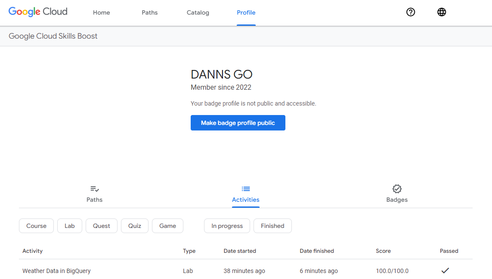
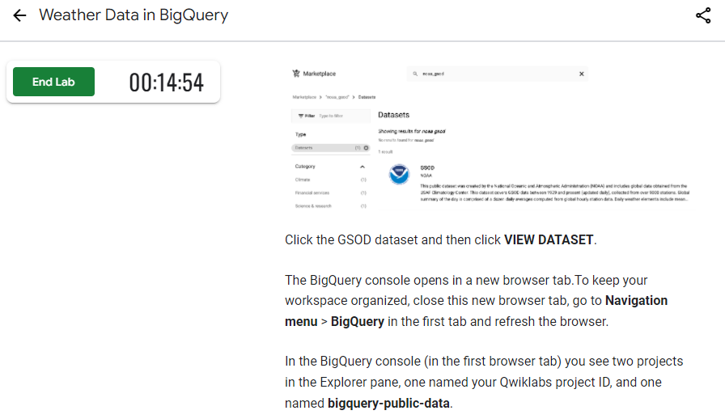

💻 **2022 ** Google Cloud Study Jam**** AI & ML 입문 과정에 참여한 기록입니다.
{: .notice--primary}

## 2022 Cloud Study Jam

- 일정
  - 2022.02.28 - 참가 확정
  - 2022.03.28 - Study Jam 종료
  - 2022.03.29 - Study Jam 수료 체크 메일

- 교육 콘텐츠
  - 영문
- 수료 조건
  - Qwiklabs 3개 퀘스트 완료 시 Cloud Study Jam 완주 기념품 증정
- 추천 강좌
  - Google Developer Essentials
  - Perform Foundational Infrastructure Tasks in Google Cloud
  - Advanced ML: ML Infrastructure
  - Networking in Google Cloud
  - Build and Secure Networks in Google Cloud
  - Deploy and Manage Cloud Environments with Google Cloud
  - Baseline: Data, ML, AI
  - Explore Machine Learning Models with Explainable AI
  - Perform Foundational Data, ML, and AI Tasks in Google Cloud
  - Intro to ML: Image Processing
  - Intro to ML: Language Processing
  - Intermediate ML: TensorFlow on GCP
  - Data Science on Google Cloud: Machine Learning

## Weather Data in BigQuery

- Click the GSOD dataset and then click **VIEW DATASET**.
  - 이 과정에서 학습 진행에 어려움을 겪었습니다. 새 탭으로 열기를 하면 Google Cloud Skills Boost에서 실습 시작하면 부여하는 계정이 아닌 본 계정으로 계정 전환이 되어서 bigquery-public-data가 생성되지 않았습니다.
    => 해결한 방법으로는 열어진 새 탭에서 구글 본 계정을 로그아웃하고 Google Cloud Skills Boost에서 부여하는 학습 계정으로 로그인해서 진행하면 됩니다. 로그아웃을 해도 진행 중인 실습은 중지되지 않고 계속해서 실습이 가능합니다.

